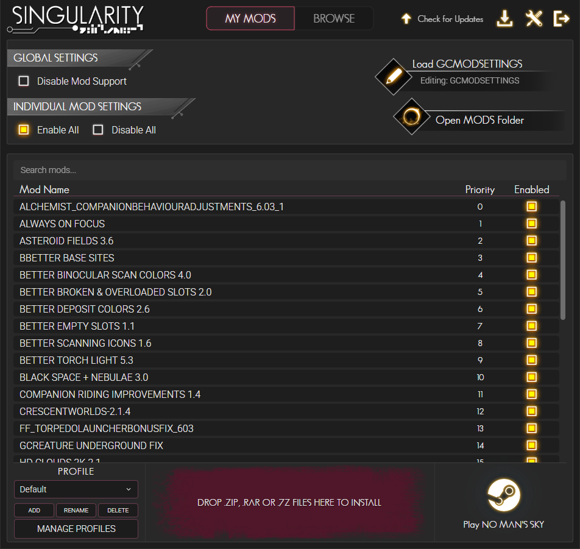
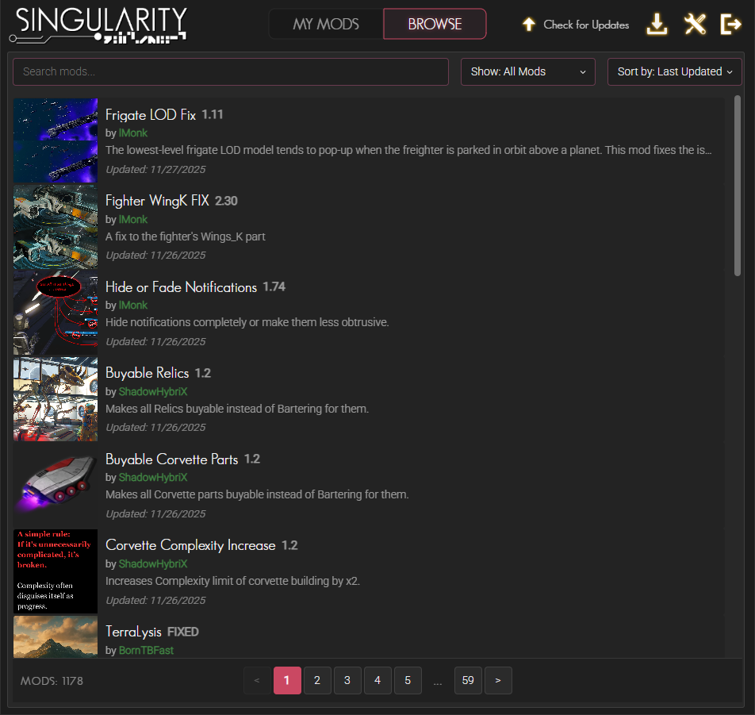
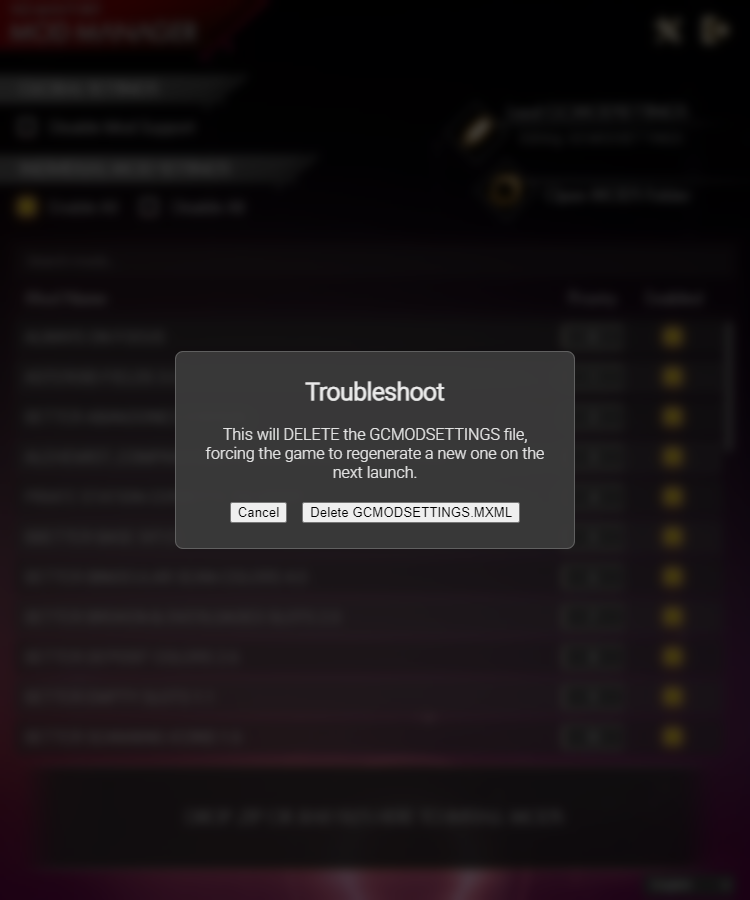

# NMS Mod Manager

A lightweight Windows-based Mod manager for No Man's Sky built with Tauri v2 that started as a curiosity.

## Features

*   **Automatic Game Detection:** Finds your Steam, GOG or Gamepass PC installation of No Man's Sky automatically.
*   **Mod Management:** Easily enable, disable, download, install and set the priority of your mods.
*   **Mod Update Check:** Easily check for updates for your installed mods.
*   **Drag & Drop Installation:** Install mods by simply dropping `.zip` or `.rar` files onto the application.
*   **Nexus Mods Integration with SSO:** Link the Manager with your Nexus Account through the Single Sign-On and download mods using the "Mod Manager Download" button or if you have a Premium Account you can browse and download mods directly through the Manager itself.
*   **Profiles:** Includes option to save mod profiles for different play styles.

## Dependencies

Pretty much the only dependency is WebView2 that if you have an updated Windows 10 or Windows 11, your machine should have it.
If not, you can get it [here](https://developer.microsoft.com/en-us/microsoft-edge/webview2?form=MA13LH#download).
